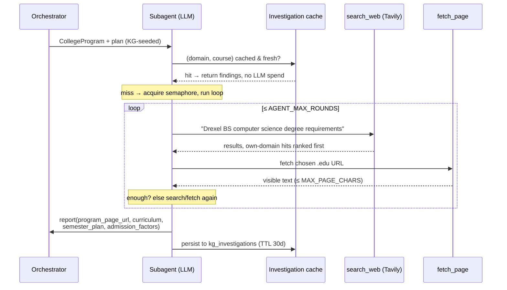
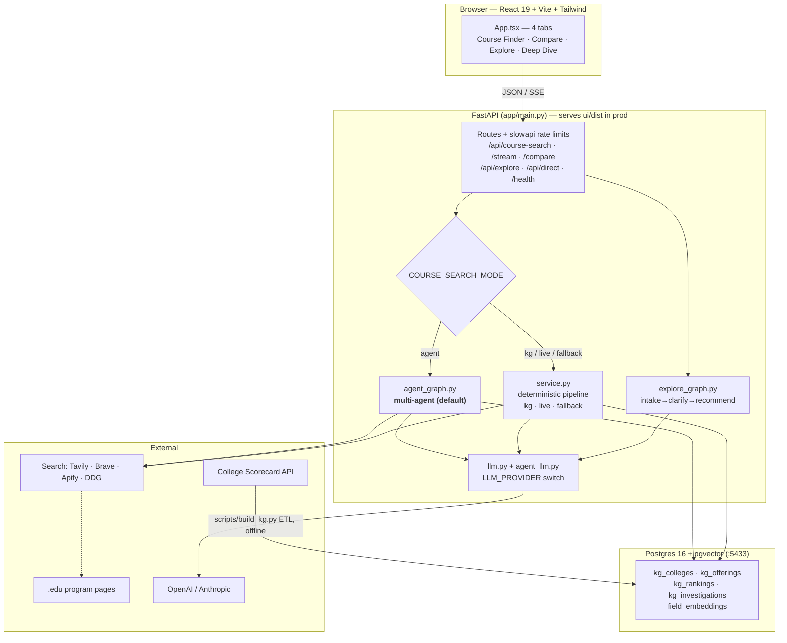
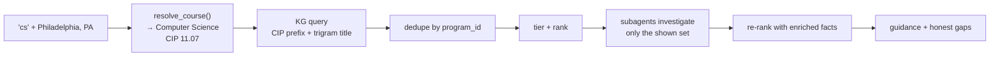

# AI Career Exploration

A decision-support tool for high-school students choosing a STEM path and the colleges that
teach it. Two halves share one app:

1. **Field exploration** — compare STEM fields, chat your way to a shortlist, deep-dive one field.
2. **Course-driven college aggregator** — search a *course*, get the colleges that offer it,
   grouped in expanding geographic rings, with standardized finer details and a citation on
   every fact.

The governing rule for the aggregator is **no manufactured data**. Nothing shown to a student
is invented: every figure carries a source label and an as-of date, and a field that cannot be
verified is rendered as "unavailable — verify on the official site" with a link, never as a
blank that implies a value.

---

## Quick start

```bash
cp .env.example .env      # add OPENAI_API_KEY (or ANTHROPIC_API_KEY) + TAVILY_API_KEY
make up                   # Postgres → migrations → API + built UI on :8000
```

Open http://localhost:8000. `make logs` to follow, `make down` to stop.

On a fresh database, populate the knowledge graph once:

```bash
make docker-build-kg                                    # offline sample (8 colleges)
make docker-build-kg ARGS="--source api --states PA,NJ --cip 11,14,26,27,40,42,45,51,52"
```

<details>
<summary>Host dev loop (hot reload, no Docker for the app)</summary>

```bash
make install     # python3.13 venv + deps
make dev-db      # Postgres only, on :5433
make dev-kg      # backend on :8000 (or `make dev` / `make dev-real`)
make dev-ui      # Vite on :5173, proxies /api → :8000
```
</details>

---

## The multi-agent core

The aggregator is not a scraper on a cron and not a curated database. It is a **LangGraph
multi-agent workflow**: an orchestrator seeds the candidate set, then one investigator agent
per college goes and reads that college's own website, in parallel. This is the default
request path (`COURSE_SEARCH_MODE=agent`).

The design turns on one observation: **the set of US colleges is finite and already published**.
So the agents never waste turns discovering *which* colleges exist — the knowledge graph hands
them the right ~13 institutions instantly, with real coordinates and baseline federal facts.
Agent budget goes entirely to the part that genuinely requires judgment: finding and reading
the program page for *this* college and *this* course.

### The graph


`findings` is an `Annotated[list, operator.add]` channel, so LangGraph reduces the parallel
subagent returns into one list without the nodes coordinating.

### Inside one college subagent

Each subagent is a real tool-use loop — it decides what to search, which page to read, and
when it has enough. It is not a prompt template with a fixed pipeline.



**Three tools, one of them terminal.** `search_web` and `fetch_page` gather; `report` ends the
loop with a typed payload. On the final round the loop forces `tool_choice = report`, so an
agent that keeps browsing still yields something structured instead of timing out.

**Anti-fabrication is built into the loop, not bolted on after.** The system prompt instructs
the agent to leave a field out rather than guess, `report`'s schema makes every finding except
the page URL optional, and a subagent that never calls `report` returns the program flagged
`catalog_page_not_found` — an honest gap, not a filled-in guess. Findings are attached with the
URL the agent actually read, so the UI can cite it.

**Cost and rate-limit control** — the practical constraints that shaped the design:

| Control | Mechanism | Why |
|---|---|---|
| Fan-out width | KG pre-ranks to the ~13 shown colleges | Investigate only what a student will see |
| Concurrency | module-level `asyncio.Semaphore(AGENT_CONCURRENCY)` | A 13-wide fan-out otherwise 429s a low tier |
| Loop depth | `AGENT_MAX_ROUNDS` (default 4), forced report on the last | Bounds worst-case spend per college |
| Search tokens | Tavily/Brave, not the LLM's own web-search tool | Search burns **zero** LLM tokens; reasoning only |
| Repeat work | `kg_investigations`, keyed `(domain, course)`, TTL 30d | Survives restarts; paid once across modes |
| Page size | truncation at `MAX_PAGE_CHARS` | One catalog page can't blow the context |

**Provider-agnostic agents.** `agent_llm.py` takes neutral tool specs — `{name, description,
input_schema}` — and adapts them to OpenAI function calling or Anthropic tool use. `LLM_PROVIDER`
flips both the agent loop and every other LLM feature (`app/llm.py`), so the whole app moves
providers with one variable. `MOCK_LLM=1` / `MOCK_CLAUDE=1` short-circuits to deterministic
findings for offline dev and tests.

**Live progress.** `POST /api/course-search/stream` runs the same graph under `astream`, turning
node updates into SSE: `seeded{total}` → `investigating{done,total}` per college → `done{result}`.
The progress bar reports real agent completions, not a fake timer.

### A second, simpler graph

Explore mode (`/api/explore`) is its own LangGraph: `intake → clarify (≤2 turns) → recommend`,
where `recommend` embeds the student's interests and runs a pgvector similarity search over the
20-field knowledge base. Conversation state is checkpointed per session.

---

## System architecture



### Request flow, end to end



**Geographic tiering** (`ranking.py`) — four expanding rings, each capped, no college repeated
across rings:

| Tier | Rule | Cap | Sort |
|---|---|---|---|
| `nearby` | haversine ≤ `nearby_radius_miles` (150) | 3 | distance |
| `home_state` | `state == home_state` | 3 | distance |
| `nearby_home_states` | `NEIGHBORING_STATES[home_state]` — a hand-built 50-state + DC land-adjacency map | 3 | distance |
| `best_usa` | everything else | 4 | composite score |

**Ranking is transparent and explicitly not U.S. News.** `ranking_score` is a composite of open
College Scorecard outcomes — graduation .35, earnings .30, selectivity .20, value .15 — with the
breakdown shown in the UI. Metrics a college lacks are skipped and the remaining weights
renormalized — never backfilled. Proprietary ranking numbers are never scraped; `rankings[]` holds
verify-links only. Licensed ranks load into `kg_rankings` and serve only when `RANKINGS_LICENSED=1`.

---

## Course search modes

| Mode | Path | Latency | LLM cost | Use |
|---|---|---|---|---|
| `agent` *(default)* | KG seed → per-college subagents → aggregate | 30–60s cold, cached after | per college | Full product experience |
| `kg` | KG → rank → optional `enrich_shown_programs` | ~50ms (+enrichment) | none unless `COURSE_READ_PAGES=1` | Fast, deterministic, cheap |
| `live` | Web discovery only, no KG | slow | extraction only | Debugging discovery |
| `fallback` | `data/college_programs.yaml` | instant | none | Tests, offline demos |

`kg` and `agent` need `KG_BACKEND=postgres` + a populated KG; with `KG_BACKEND=sample` you get
the 8-college demo file. Note that `live` mode drops the KG entirely and returns thin stubs —
if results look empty or placeholder-ish, check that mode isn't exported in your shell.

---

## Data sourcing

| Field group | Source | Freshness |
|---|---|---|
| Institution identity, location, control, level | College Scorecard (IPEDS-derived) | ETL re-run; `as_of` year stored |
| Admission rate, tuition, net price, grad rate, median earnings | College Scorecard | same |
| Carnegie classification | Carnegie (free file) via `make load-carnegie` | manual load |
| Curriculum, semester plan, admission factors, deadlines | The college's **own .edu page**, read live by a subagent | `kg_investigations` TTL 30d |
| Licensed ranks | Your licensed file via `make load-rankings` | off unless `RANKINGS_LICENSED=1` |

Discovery search is pluggable via `SEARCH_PROVIDER`: `tavily` (default), `brave`, `apify`,
`claude`, `duckduckgo`.

---

## API

| Endpoint | Purpose |
|---|---|
| `POST /api/course-search` | Course → colleges in 4 geographic tiers |
| `POST /api/course-search/stream` | Same, as SSE with live agent progress |
| `POST /api/compare` | Compare 2–3 STEM fields (422 on partial not-found) |
| `POST /api/explore` | Multi-turn explore chat (LangGraph + pgvector) |
| `POST /api/direct` | Deep-dive one field |
| `GET /api/fields` · `GET /health` · `POST /api/cache/clear` | Support |

```bash
curl -s -X POST localhost:8000/api/course-search \
  -H 'content-type: application/json' \
  -d '{"course_query":"nursing","city":"Philadelphia","state":"PA"}'
```

Request fields are flat: `course_query` (required), `city`, `state`, `home_state`. Each tier
returns `{tier, title, programs[]}`, and each entry is `{program, distance_miles, match_reason}`.

---

## Layout

```
app/
  main.py                    FastAPI routes, lifespan, static UI mount
  llm.py                     provider-agnostic completion (LLM_PROVIDER)
  explore_graph.py           LangGraph: intake → clarify → recommend
  course_search/
    agent_graph.py           ★ orchestrator graph + SSE streaming
    subagent.py              ★ per-college investigator agent (tools, prompt, guards)
    agent_llm.py             ★ provider-agnostic tool-use loop
    investigation_cache.py   ★ persistent findings cache (kg_investigations)
    knowledge_graph.py       KG stores + Scorecard → CollegeProgram mapping
    cip_aliases.py           "cs" → Computer Science, CIP 11.07
    ranking.py               state adjacency, haversine, tiers, composite score
    reader.py                page fetch + LLM extraction + KG enrichment path
    search_backends.py       Tavily / Brave / Apify / Claude / DuckDuckGo
    service.py               deterministic kg/live/fallback pipeline
scripts/                     migrations, build_kg ETL, embeddings, loaders
ui/src/components/           CourseFinder · ComparisonResult · ChatInterface · DeepDivePage
docs/DESIGN.md               full 16-section design document
```

---

## Testing

```bash
COURSE_SEARCH_MODE=fallback KG_BACKEND=sample make test     # 144 passing
```

Those two variables matter: the suite loads `.env`, so a developer whose `.env` points at a
running Postgres KG will see `test_course_finder.py` fail — it asserts on the curated fixture
but gets real KG rows instead. Run tests with the fallback repo as shown.

---

## Deployment

`Dockerfile` is a two-stage build (Node builds the React app; Python serves it and the API from
one process on `:8000`). `render.yaml` deploys it to Render. `docker-compose.yml` runs the full
local stack — `db` → `migrate` (one-shot) → `app`, plus a profile-gated `kg-build` for the ETL.
